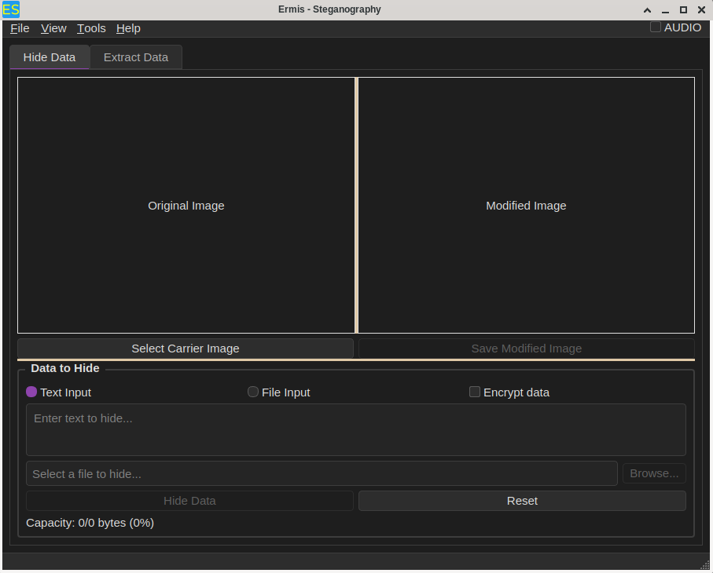

# Ermis - Steganography Tool



Ermis is a cross-platform steganography application that allows you to hide and extract secret data within digital media files. Named after the Greek god of messages and communication, Ermis enables covert communication through innocent-looking image and audio files.

Available in Flathub:
https://flathub.org/en/apps/search?q=alamahant

## Features

### 🖼️ Image Steganography
- Hide data in PNG, JPG, and BMP images using LSB (Least Significant Bit) techniques
- Live preview of original and modified images
- Visual comparison between carrier and stego images

### 🎵 Audio Steganography
- Support for WAV, MP3, FLAC, and OGG audio files
- Automatic conversion of non-WAV files to WAV format using FFmpeg
- Preserves audio quality while hiding data

### 🌐 Network Steganography (ERTP Protocol)

Ermis implements **ERTP (Ermis Reliable Transfer Protocol)**, a steganographic data transfer protocol that embeds secret data within legitimate network packets. Data is hidden inside ICMP Echo/Reply, DNS queries, UDP datagrams, or HTTP/TLS traffic, appearing as normal network activity to observers.

**Supported Protocols:**
- **ICMP (ping)** - Data hidden in ICMP Echo Request/Reply packets
- **DNS** - Data embedded in DNS query/response over UDP
- **UDP** - Direct UDP packet embedding on configurable ports
- **HTTP/TLS** - Secure HTTPS tunnel steganography

**Reliable Transfer Features:**
- Session-based communication with 32-bit unique identifiers
- Sliding window protocol with ACK/NACK acknowledgment system
- CRC32 checksum validation for data integrity
- Automatic retransmission with configurable timeouts (1000-2000ms)
- Transfer progress tracking with cancellation support

**Security & Control:**
- Optional AES-256-CBC encryption with ENCR flag detection
- IP filtering with whitelist/blacklist and CIDR notation support
- Configurable port binding for UDP/DNS/HTTP protocols
- Passphrase-protected content encryption

**Data Handling:**
- Text messages with real-time display and clipboard copy
- File transfers with original filename preservation
- Received files stored in temp folder with save-as export
- Automatic text/binary format detection
- Event log with timestamped status messages

**Critical Coordination Requirements:**
- Both sender and receiver MUST use the same protocol and port
- Sender MUST also be listening to receive ACK packets
- Without proper listening, transmission will fail
- ICMP requires root/admin privileges; UDP/DNS/HTTP work without special permissions

**UI Features:**
- Dual-tab interface (Send Data / Receive Data)
- Target IP history with auto-completion
- Real-time progress bars for send/receive operations
- Received files list with save-selected functionality
- Clear temp folder option for received file cleanup
- Info button (ⓘ) with comprehensive protocol documentation

For detailed protocol specification, see the [ERTP Protocol Documentation](https://github.com/alamahant/ERTP).

### 📝 Text Steganography
- Hide data in plain text using invisible zero-width Unicode characters (U+200B, U+200C)
- Binary-to-zero-width mapping with 4-byte header for data integrity
- Real-time capacity calculation based on cover text length
- Copy-to-clipboard and save-to-file for stego text
- Automatic text/binary detection during extraction

### 📄 PDF Steganography
- Hide data in PDF files using /ObjStm object streams with FlateDecode compression
- Incremental update structure for broad viewer compatibility
- Capacity limit of ~50% of carrier PDF size
- FNAM flag preserves original filename for binary files
- ENCR flag enables automatic encryption detection on extraction
- Real-time capacity display and validation

### 🌐 Distributed Steganography
- Hide messages across Wikipedia articles using word position pointers
- No single carrier file — message reconstructed from JSON pointer map
- Support for 10 Wikipedia languages (English, German, French, Spanish, Italian, Portuguese, Dutch, Russian, Japanese, Chinese)
- JSON map format with language wrapper for cross-platform compatibility
- Optional AES-256-CBC encryption of entire pointer map
- Rate-limited Wikipedia API calls with automatic throttling
- Real-time progress tracking for word mapping

### 📝 Data Handling
- **Text Input**: Hide plain text messages
- **File Input**: Hide any file type (documents, images, archives, etc.)
- **Filename Preservation**: Original filenames are stored and recovered during extraction
- **Smart Detection**: Automatically distinguishes between text and file data

### 🔒 Security Features
- **AES Encryption**: Optional encryption with passphrase protection
- **Passphrase Memory**: Remember passphrases during the current session
- **ENCR Marker**: Automatically detects and handles encrypted data

### 🎨 PRT Mode (Artistic Steganography)
- Specialized mode for creating visual steganographic codes
- Camera scanning support for PRT code detection
- Ideal for artistic and creative steganographic applications

### 📋 User Interface
- **Dual-Tab Interface**: Separate tabs for hiding and extracting data
- **Drag & Drop**: Simply drag files directly into the application
- **Live Capacity Indicator**: Shows available space in real-time
- **Clipboard Integration**: Copy extracted text with one click
- **Status Bar**: Real-time feedback on operations
- **Directory Fallbacks**: Smart path handling (Pictures → Images, Music → AppDir)

### 🔍 Extraction Features
- Automatic detection of encryption and PRT mode
- Filename recovery from hidden files
- Smart truncation for very large text (prevents UI freezing)
- Save extracted data to any location
- Text preview for readable content

## Installation

### Prerequisites
- Qt 6.2 or higher
- FFmpeg libraries
- C++17 compatible compiler

### Building from Source

```bash
# Clone the repository
git clone https://github.com/alamahant/Ermis.git
cd Ermis

# Create build directory
mkdir build && cd build

# Configure with CMake
cmake ..

# Build
make

# Run
./Ermis
```
---

## License

Copyright © 2026 Alamahant

Ermis is licensed under the GNU General Public License v3.0 (GPL-3.0) - see the [LICENSE](LICENSE) file for details.

This program is free software: you can redistribute it and/or modify it under the terms of the GNU General Public License as published by the Free Software Foundation, either version 3 of the License, or (at your option) any later version.

## Disclaimer

Ermis is designed for legitimate purposes only:
- Privacy protection for personal information
- Digital watermarking of creative works
- Educational use for learning steganography techniques
- Authorized communication with proper consent

Users are solely responsible for compliance with applicable laws in their jurisdiction. The author assumes no liability for misuse of this software.

